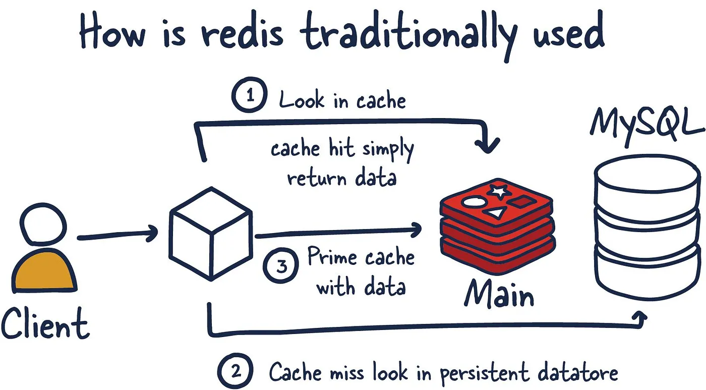

# EP - Cache con Redis

> **EP** = *Ejemplo Práctico*. Este proyecto es una demo educativa que muestra, con el mínimo código posible, cómo usar **Redis como caché** delante de una fuente de datos lenta usando el patrón **cache-aside**.

## Índice

- [Qué es Redis](#qué-es-redis)
- [Caso de uso típico](#caso-de-uso-típico)
  - [Flujo](#flujo)
  - [TTL (Time To Live)](#ttl-time-to-live)
- [Cómo funciona esta demo](#cómo-funciona-esta-demo)
- [Requisitos previos](#requisitos-previos)
- [Puesta en marcha](#puesta-en-marcha)
- [Variables de entorno](#variables-de-entorno)
- [Endpoints](#endpoints)
- [Probar la caché paso a paso](#probar-la-caché-paso-a-paso)
- [Estructura del proyecto](#estructura-del-proyecto)

## Qué es Redis

Redis es una base de datos en memoria que permite almacenar datos de manera muy rápida y eficiente, y es ampliamente utilizada para caching, o almacenamiento en caché. La caché es una técnica que guarda temporalmente datos para reducir el tiempo y el costo de obtener información desde una base de datos principal, especialmente cuando se requiere acceder a esos datos de forma repetida.

## Caso de uso típico



En un escenario típico de uso de Redis como caché, el flujo funciona de la siguiente manera:

### Flujo

- **_cache hit_**: Cuando el cliente (que puede ser una aplicación o servicio) necesita acceder a un dato, primero verifica si este ya está en Redis. Este paso se llama **_cache hit_** si el dato se encuentra en la caché, y se devuelve inmediatamente al cliente sin realizar consultas adicionales.

- **_cache miss_**: Si Redis no contiene el dato solicitado (es un cache miss), la consulta se redirige al repositorio/servicio donde se encuentran los datos almacenados permanentemente. Este acceso suele ser mucho más lento que acceder a una caché en memoria.

- **_prime cache_**: Una vez que el repositorio/servicio devuelve el dato solicitado, este se guarda en Redis para que, en futuras solicitudes, esté disponible directamente en la caché. Este proceso se llama "prime cache" o "inicializar la caché".

La ventaja de este flujo es que Redis almacena datos en memoria, lo que permite tiempos de respuesta rápidos. Así, Redis reduce la cantidad de consultas que necesita hacer a las base de datos persistente o servicios externos, mejorando el rendimiento general del sistema e incluso ahorrando costos.

### TTL (Time To Live)

Una característica importante de Redis como caché es la capacidad de establecer un TTL (Time To Live) para los datos almacenados. El TTL define un tiempo de expiración para cada clave almacenada en Redis, indicando cuánto tiempo debe conservarse el dato antes de ser eliminado automáticamente. Esto ayuda a mantener la caché actualizada con datos frescos y evita que se acumulen datos obsoletos o que la memoria se llene innecesariamente.

Por ejemplo, si un dato en la caché tiene un TTL de 5 minutos, Redis lo eliminará una vez transcurrido ese tiempo, obligando a la próxima consulta a hacer un cache miss y buscar el dato actualizado en la base de datos principal. El uso del TTL es fundamental para optimizar el rendimiento de la caché y asegurar que los datos en Redis sigan siendo relevantes y precisos.

## Cómo funciona esta demo

Para que el ejemplo sea reproducible sin una base de datos real, se simula una **consulta lenta** (`queryQueTarda`) que tarda **2 segundos** en responder (configurable con `DEMORA_QUERY_MS`) y genera datos falsos. Sobre esa consulta lenta aplicamos el patrón cache-aside:

```
GET /:id
   │
   ▼
┌─────────────────────┐   sí (cache hit)
│ ¿Está la clave en   │ ───────────────► devuelve desde Redis  (~instantáneo)
│ Redis? (middleware) │
└─────────────────────┘
   │ no (cache miss)
   ▼
consulta lenta (~2 s) ──► guarda en Redis con TTL de 60 s ──► devuelve al cliente
```

- El **middleware** (`src/redis.middleware.js`) intercepta la request *antes* del handler: si la clave existe responde con el dato cacheado y el handler nunca se ejecuta.
- La **clave de Redis es el `:id`** de la URL. Por ejemplo, `GET /42` se cachea bajo la clave `42`.
- Al cachear se usa un **TTL de 60 segundos** (configurable con `CACHE_TTL_SEGUNDOS`): pasado ese tiempo la clave expira y la siguiente consulta vuelve a ser un cache miss.

## Requisitos previos

- [Node.js](https://nodejs.org/) 18 o superior
- [Docker](https://www.docker.com/) y Docker Compose (para levantar Redis)

## Puesta en marcha

```bash
# 1. Instalar dependencias
npm install

# 2. Levantar Redis + RedisInsight (lee REDIS_PASSWORD desde .env)
docker compose up -d

# 3. Arrancar la app con recarga automática
npm run dev
```

La aplicación queda escuchando en `http://localhost:3000` (según el `PORT` del `.env`).

Servicios que levanta Docker Compose:

| Servicio       | Puerto | Para qué sirve                                   |
| -------------- | ------ | ------------------------------------------------ |
| `redis`        | 6379   | El servidor Redis (la caché).                    |
| `redisinsight` | 5540   | UI web para inspeccionar las claves: http://localhost:5540 |

> En **RedisInsight** podés conectarte a `localhost:6379` con la contraseña del `.env` y ver en vivo cómo aparecen y expiran las claves.

## Variables de entorno

El repo incluye un `.env` de ejemplo (por ser una demo). Variables disponibles:

| Variable             | Por defecto              | Descripción                                       |
| -------------------- | ------------------------ | ------------------------------------------------- |
| `PORT`               | `3000`                   | Puerto donde escucha la app.                      |
| `REDIS_URL`          | `redis://localhost:6379` | URL de conexión a Redis.                          |
| `REDIS_PASSWORD`     | `1qaz!QAZ`               | Contraseña de Redis.                              |
| `CACHE_TTL_SEGUNDOS` | `60`                     | Segundos que vive cada clave en la caché (TTL).   |
| `DEMORA_QUERY_MS`    | `2000`                   | Demora simulada de la "consulta lenta" (ms).      |

## Endpoints

| Método   | Ruta    | Descripción                                                                 |
| -------- | ------- | -------------------------------------------------------------------------- |
| `GET`    | `/:id`  | Devuelve el dato del `id`. Cache hit → instantáneo; cache miss → ~2 s.     |
| `DELETE` | `/:id`  | Invalida (borra) la clave `id` de la caché. Responde `204`.               |

## Probar la caché paso a paso

Con la app corriendo, podés notar la diferencia de tiempos a simple vista:

```bash
# 1. Primera vez: CACHE MISS -> tarda ~2 segundos
curl http://localhost:3000/42

# 2. Segunda vez: CACHE HIT -> responde al instante (viene de Redis)
curl http://localhost:3000/42

# 3. Invalidamos la clave en la caché
curl -X DELETE http://localhost:3000/42

# 4. Vuelve a ser CACHE MISS -> tarda ~2 segundos otra vez
curl http://localhost:3000/42
```

> 💡 Si en el paso 2 esperás más de 60 segundos antes de repetir la consulta, la clave habrá expirado por el TTL y volverás a ver un cache miss.

## Estructura del proyecto

```
.
├── docker-compose.yml          # Redis + RedisInsight
├── .env                        # Variables de entorno (demo)
└── src
    ├── app.js                  # Servidor Express, rutas y consulta lenta simulada
    ├── redis.js                # Cliente Redis compartido
    ├── redis.middleware.js     # Middlewares checkCache / deleteCache (cache-aside)
    └── fakeData
        ├── data.js             # Genera datos falsos con mgeneratejs
        └── template
            └── fanclub.json    # Plantilla de los datos generados
```
